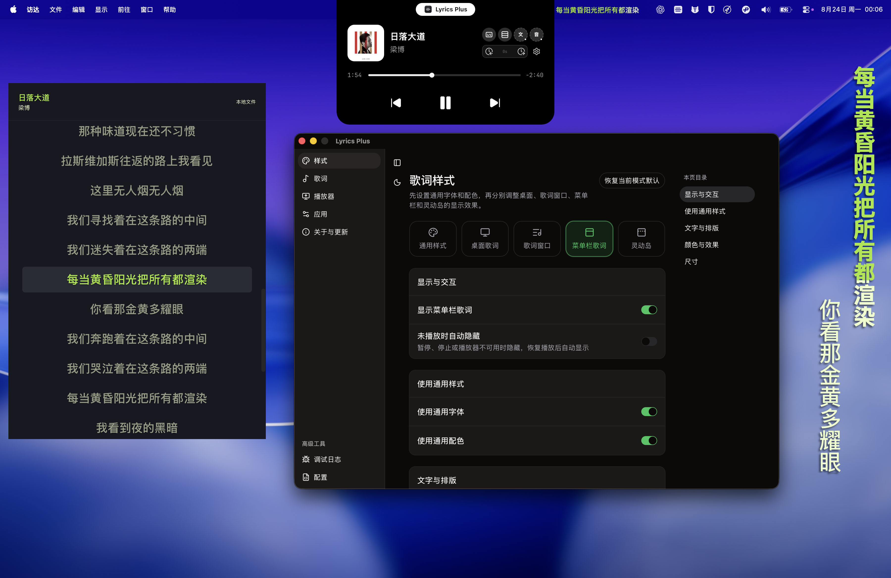

<div align="center">
  <h1>Lyrics Plus</h1>
  <p>A simple, synchronized lyrics companion for macOS.</p>
  <p><strong>macOS 13+ · Apple Silicon & Intel · MIT License</strong></p>
  <p><a href="README_ZH.md">简体中文</a> · English</p>
</div>

Lyrics Plus is a free and open-source macOS app that follows your music player and keeps lyrics in sync with the current track and playback position. It is built with Tauri 2, React, TypeScript, and Rust.

## Screenshots

<table>
  <tr>
    <td width="50%" align="center">
      
      <br>
      <sub>Lyrics display modes</sub>
    </td>
    <td width="50%" align="center">
      
      <br>
      <sub>Lyrics display and style settings</sub>
    </td>
  </tr>
</table>

## Feature Support

| Feature | Support |
|---|---|
| Lyrics display | Desktop Lyrics, Menu Bar Lyrics, Lyrics Window, and Dynamic Island Lyrics |
| Playback sources | Apple Music, Spotify, and compatible apps through macOS System Media |
| Lyrics sources | Multiple online lyrics providers |
| Lyrics matching | Concurrent search, provider ordering, automatic matching, and metadata-based candidate ranking |
| Lyrics content | Synced lyrics, translations, romanization, word-level karaoke timing, local import, and an offline library |
| Appearance | Shared or per-mode fonts, colors, layout, opacity, and display behavior |
| Compatibility | macOS 13+, Apple Silicon, and Intel |

Online lyrics providers are optional. When enabled, matching metadata such as title, artist, album, and duration is sent to the selected third-party service.

## Download

Download the latest build from [GitHub Releases](https://github.com/afeibukaixin/Lyrics-Plus/releases/latest):

- `aarch64` for Apple Silicon Macs.
- `x64` for Intel Macs.

> [!IMPORTANT]
> **First launch:** Move Lyrics Plus to the Applications folder before opening it.
>
> Lyrics Plus shows a legal notice and asks you to accept it before continuing. Current builds use macOS ad-hoc signing and are not notarized with an Apple Developer ID. If macOS shows a security prompt or blocks the first launch, open System Settings → Privacy & Security and choose Open Anyway.

## Notes

Apple Music and Spotify may ask for Automation permission. Player following may require approval in Login Items settings. Playback controls and metadata depend on what each application exposes to macOS.

## Local Development

Requires Node.js, pnpm, Rust, and Xcode Command Line Tools.

```bash
git clone https://github.com/afeibukaixin/Lyrics-Plus.git
cd Lyrics-Plus
pnpm install
pnpm tauri dev
```

Build a local application bundle with:

```bash
pnpm tauri build
```

## Disclaimer, Copyright, and License

Read the full [English disclaimer](DISCLAIMER.md). Lyrics and other music-related content remain the property of their respective rightsholders. Lyrics Plus only provides software features for searching, parsing, caching, importing, and displaying that content; it is not affiliated with Apple Music, Spotify, any lyrics provider, or any rightsholder.

The application code is released under the [MIT License](LICENSE). The MIT License applies to the project code, not to third-party lyrics or music content.

## Acknowledgements

- [MxIris-LyricsX-Project/LyricsX](https://github.com/MxIris-LyricsX-Project/LyricsX)
- [ddddxxx/LyricsX](https://github.com/ddddxxx/LyricsX)
