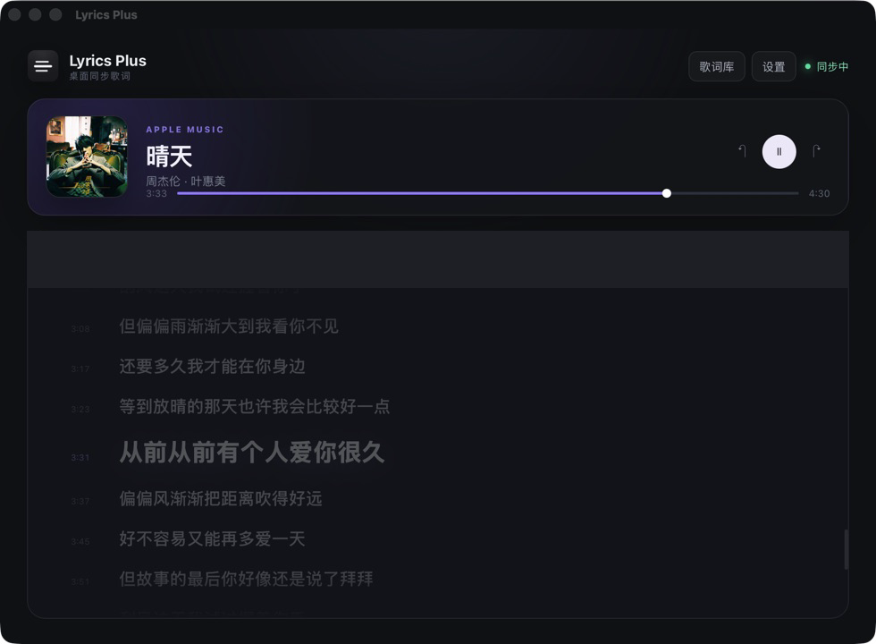
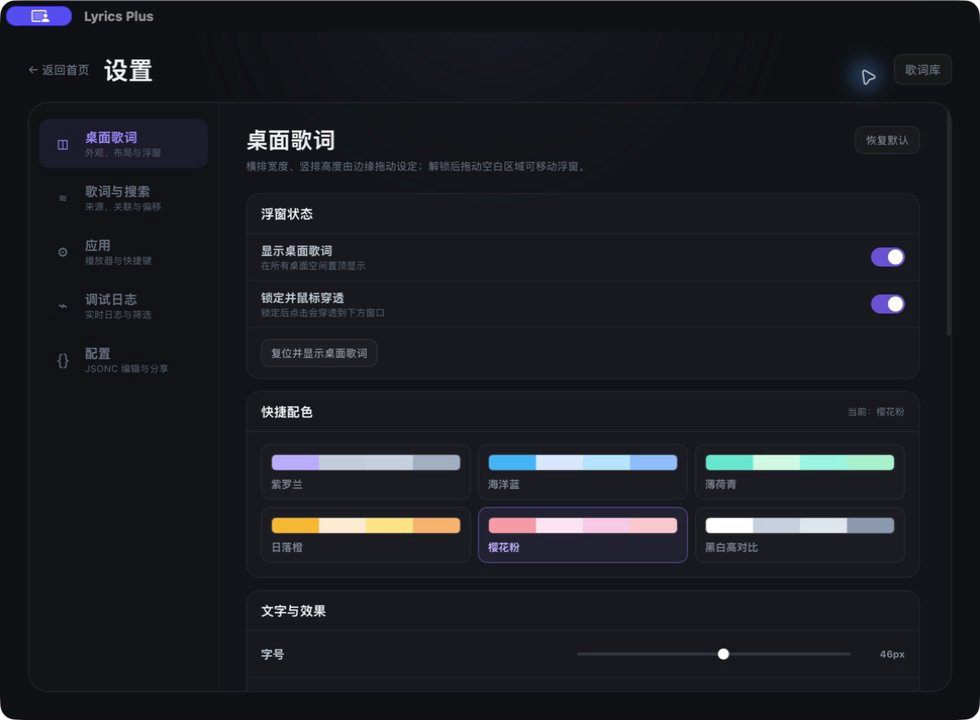

# Lyrics Plus

一个面向 macOS 的桌面同步歌词应用。Lyrics Plus 会监听正在播放的音乐，把同步歌词显示在主窗口和桌面浮窗上，让歌词始终跟着音乐走。

项目基于 Tauri 2、React、TypeScript 和 Rust，当前以 macOS 本机使用和源码开发为主。

## 截图

### 主界面



### 桌面歌词

#### 横排


#### 竖排


### 桌面歌词设置



## 功能

- 自动或手动监听 Apple Music、Spotify 的歌曲、播放状态和播放进度。
- 从多个歌词服务源并发搜索歌词，并按匹配度和歌词质量推荐候选结果。
- 支持同步歌词、翻译、音译和逐字时间轴。
- 支持手动切换候选歌词、按歌名重新搜索，以及调整歌词同步偏移。
- 支持导入本地 LRC，保存歌曲关联，离线缓存和管理歌词库。
- 提供透明置顶的桌面歌词浮窗，支持跨桌面空间和显示器显示。
- 支持移动、缩放、锁定、鼠标穿透，以及快捷复位浮窗位置。
- 支持横排/竖排、单歌词/双歌词、字号、颜色、背景、透明度和长文本显示方式。
- 支持逐词扫光、弹跳和高亮等卡拉 OK 效果。
- 提供菜单栏入口、窗口状态恢复和全局快捷键：
  - `⌘ ⇧ L`：显示 / 隐藏桌面歌词
  - `⌘ ⇧ U`：解锁桌面歌词
  - `⌘ ⇧ 0`：复位并显示桌面歌词
- 提供 JSONC 配置编辑器、配置导入/导出和实时调试日志。
- 界面支持跟随系统语言，并提供简体中文、繁体中文和英文。

## 系统要求

- macOS 13 或更高版本。
- Node.js、pnpm、Rust 工具链和 Xcode Command Line Tools。
- 若要读取或控制播放器，需要在 macOS“系统设置 → 隐私与安全性 → 自动化”中允许 Lyrics Plus 控制对应播放器。

歌词服务依赖第三方网络服务，歌词的可用性、匹配结果和响应速度可能随网络环境与服务状态变化。

## 本地开发

克隆项目后，在项目根目录执行：

```bash
pnpm install
pnpm tauri dev
```

首次运行或首次读取播放器时，macOS 可能会弹出自动化权限提示。如果之前拒绝过权限，请前往“系统设置 → 隐私与安全性 → 自动化”，找到 Lyrics Plus 并允许它控制正在使用的播放器。

## 本地构建

```bash
pnpm tauri build
```

构建产物会生成在：

```text
src-tauri/target/release/bundle/
```

当前构建默认使用 ad-hoc 签名，适合本机测试。项目暂未提供正式签名、公证和稳定发布渠道；GitHub Release 也会明确标注这一点。

如果要进行正式分发，需要准备 Apple `Developer ID Application` 证书和公证凭据，并按照 Tauri 的发布流程配置签名与公证。不要把证书、密码或 `.p8` 私钥提交进仓库。

## 开发备注

> 这是一次彻底的 Vibe Coding 实验：全程通过自然语言和 AI 工具完成，作者本人没有手写一行代码。目前额度已经用光，后续有额度再继续更新。

如果你发现问题或有想要的功能，欢迎提交 Issue；如果愿意帮忙修复或改进，也欢迎提交 Pull Request。

## 贡献

新增或修改界面、错误处理和日志时，请遵循以下约定：

- 普通 UI 文案必须补齐所有已支持语言资源并通过 i18n 输出；歌曲、歌手、歌词和第三方原始内容保持原样。详见 [`docs/i18n.md`](docs/i18n.md)。
- 普通 UI 字号、行高和字重使用既有语义化 Token；图标、桌面歌词动态字号等例外需要记录原因。详见 [`docs/typography.md`](docs/typography.md)。
- 正式内部日志使用稳定英文上下文，并保留原始错误详情；用户提示不得直接复用日志文本。详见 [`docs/logging.md`](docs/logging.md)。
- Tauri 命令错误应经过统一 API 边界转换，用户界面显示本地化错误码映射，底层 `cause` 只用于内部诊断。

提交 Pull Request 前，建议至少检查：

```bash
pnpm exec tsc --noEmit
cd src-tauri && cargo test
```

欢迎贡献界面优化、歌词解析改进、兼容性修复和文档完善。涉及歌词服务适配时，请注意第三方服务的可用性、接口变化和版权边界。

## 致谢

Lyrics Plus 的产品方向、交互思路和歌词应用经验参考了以下开源项目：

- [MxIris-LyricsX-Project/LyricsX](https://github.com/MxIris-LyricsX-Project/LyricsX)
- [ddddxxx/LyricsX](https://github.com/ddddxxx/LyricsX)

感谢原作者和维护者们对 macOS 歌词应用生态的长期投入。

## 免费、联网与版权说明

Lyrics Plus 是出于个人兴趣开发和维护的开源项目，官方渠道提供的软件本体完全免费，不设会员、订阅、激活码或强制付费。项目采用 MIT License；第三方在遵守许可证的前提下可以分发或销售软件副本，但其提供的下载、安装、打包或其他收费服务与本项目无关，也不是使用本软件所必需的。

歌词、专辑封面及其他音乐相关内容的权利归相应作者、发行方或其他合法权利人所有。Lyrics Plus 不拥有、出售或授予这些内容的版权，仅提供检索、解析、缓存、导入和展示等软件功能。软件免费或开源，不代表第三方内容可以被自由复制、传播或使用。

启用在线歌词源时，歌曲标题、歌手、专辑和时长等用于匹配歌词的信息会发送给相应的第三方服务。第三方服务的内容、可用性、准确性、授权范围和数据处理规则由其提供方决定。本项目与任何播放器、内容平台或内容权利人不存在隶属、代理或背书关系。

请仅在法律法规和相关服务条款允许的范围内使用本软件，不要未经授权复制、传播、出售、公开展示或商业利用歌词及其他受保护内容。相关权利人可以通过项目 Issue 联系维护者；核实后，项目将采取适当措施。

本软件按“现状”提供，由个人利用业余时间维护，不保证第三方服务持续可用，也不保证匹配结果完全准确。请自行备份重要的本地歌词与配置。

## License

本项目以 [MIT License](LICENSE) 发布。
