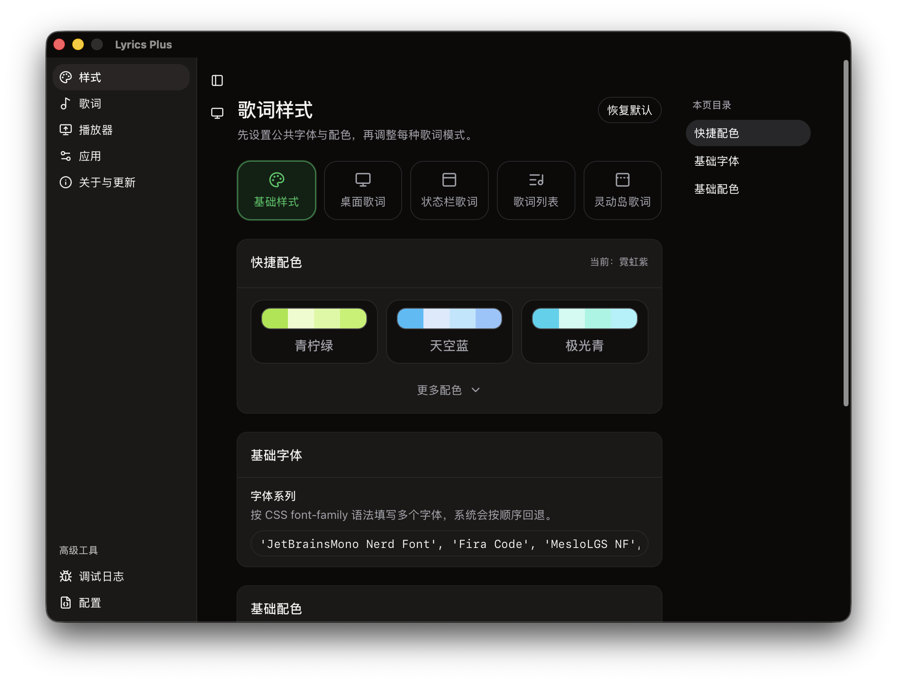
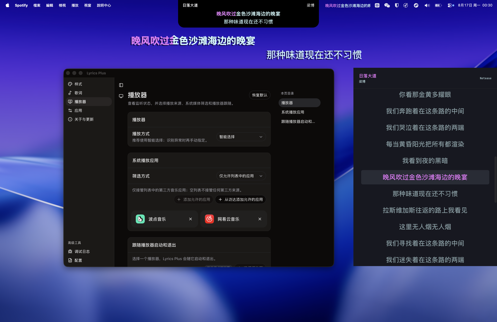
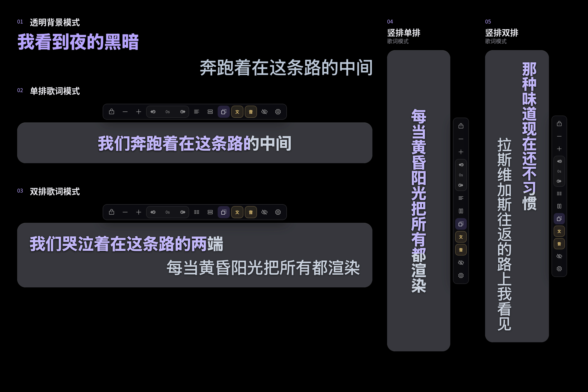

<div align="center">
  <h1>Lyrics Plus</h1>
  <p>A synchronized lyrics companion for macOS.</p>
  <p><strong>macOS 13+ · Apple Silicon & Intel · MIT License</strong></p>
  <p><a href="README_ZH.md">简体中文</a> · English</p>
</div>

Lyrics Plus is a free and open-source macOS app that follows your music player and keeps lyrics aligned with the current track and playback position. Version 2.0.0 rebuilds the settings experience and brings desktop, menu bar, list, and Dynamic Island lyrics into one configurable system.

It is built with Tauri 2, React, TypeScript, and Rust.

## Screenshots







## Display Lyrics Your Way

- **Desktop Lyrics:** an always-on-top overlay that can move across Spaces and displays, resize, lock, pass clicks through, hide when playback stops, and reset its position.
- **Menu Bar Lyrics:** show the current lyric in the macOS menu bar with configurable width, colors, and scrolling behavior.
- **Lyrics List:** open a standalone, scrollable lyrics window with optional translation and romanization.
- **Dynamic Island Lyrics:** attach lyrics to the top of a display, reveal controls on hover, and choose single- or double-line lyrics.

Shared typography and colors can be inherited by each mode or refined independently. Configure fonts, font sizes, weights, alignment, opacity, backgrounds, active and inactive colors, translations, romanization, and word-level karaoke timing.

## Playback Sources

- **Apple Music and Spotify:** dedicated macOS listeners with playback state and automation support.
- **System Media:** follow compatible third-party media apps exposed by macOS, with allowlist and blocklist filtering.
- **Player following:** optionally start and quit Lyrics Plus together with a selected player through the bundled helper service.
- **Startup controls:** silent startup, menu bar access, Dock visibility, and automatic or manually selected player detection.

Apple Music and Spotify may ask for Automation permission. Player following may require approval in Login Items settings. Playback controls and metadata depend on what each application exposes to macOS.

## Lyrics Search and Library

- Search LRCLIB, Kugou, QQMusic, Netease, Kuwo, AMLL TTML, Migu, and Musixmatch concurrently.
- Musixmatch uses the unofficial Desktop interface with an automatically obtained anonymous token by default. Users can optionally provide a Desktop token or official Developer API key; tokens stay in a separate local credentials file and are excluded from configuration exports.
- Reorder or disable providers, choose smart or strict provider ordering, test provider health, and set an automatic match threshold.
- Rank candidates using title, artist, album, duration, and capability information, with title filters and simplified/traditional Chinese matching.
- Display synchronized LRC, translations, romanization, and word-level timing when available.
- Import local lyrics, keep an offline lyrics library, associate lyrics with tracks, and adjust timing offsets.

Online providers are optional. When enabled, matching metadata such as title, artist, album, and duration is sent to the selected third-party service.

## Settings and Maintenance

The settings window is organized into Style, Display & Interaction, Lyrics, Player, Application, Debug Logs, Configuration, and About & Updates.

- Edit configuration as JSONC with comments and trailing commas.
- Inspect live debug logs when troubleshooting.
- Use four interface languages: English, Simplified Chinese, Traditional Chinese (Hong Kong), and Traditional Chinese (Taiwan).
- Review release notes, download updates with progress information, and choose when to restart after installation.

## Download

Download the latest build from [GitHub Releases](https://github.com/afeibukaixin/Lyrics-Plus/releases/latest):

- `aarch64` for Apple Silicon Macs.
- `x64` for Intel Macs.

Move Lyrics Plus to the Applications folder before opening it. Current builds use macOS ad-hoc signing and are not notarized with an Apple Developer ID. If macOS blocks the first launch, open System Settings → Privacy & Security and choose Open Anyway.

## Global Shortcuts

These are the default shortcuts. Additional display shortcuts can be configured in Application settings.

| Shortcut | Action |
|---|---|
| `⌘ ⇧ L` | Show or hide Desktop Lyrics |
| `⌘ ⇧ U` | Lock or unlock Desktop Lyrics |
| `⌘ ⇧ 0` | Reset and show Desktop Lyrics |

## Local Development

Requires Node.js, pnpm, Rust, and Xcode Command Line Tools.

```bash
git clone https://github.com/afeibukaixin/Lyrics-Plus.git
cd Lyrics-Plus
pnpm install
pnpm tauri dev
```

Build a local application bundle with:

```bash
pnpm tauri build
```

## Disclaimer, Copyright, and License

Read the full [English disclaimer](DISCLAIMER.md). Lyrics and other music-related content remain the property of their respective rightsholders. Lyrics Plus only provides software features for searching, parsing, caching, importing, and displaying that content; it is not affiliated with Apple Music, Spotify, any lyrics provider, or any rightsholder.

The application code is released under the [MIT License](LICENSE). The MIT License applies to the project code, not to third-party lyrics or music content.

## Acknowledgements

- [MxIris-LyricsX-Project/LyricsX](https://github.com/MxIris-LyricsX-Project/LyricsX)
- [ddddxxx/LyricsX](https://github.com/ddddxxx/LyricsX)
