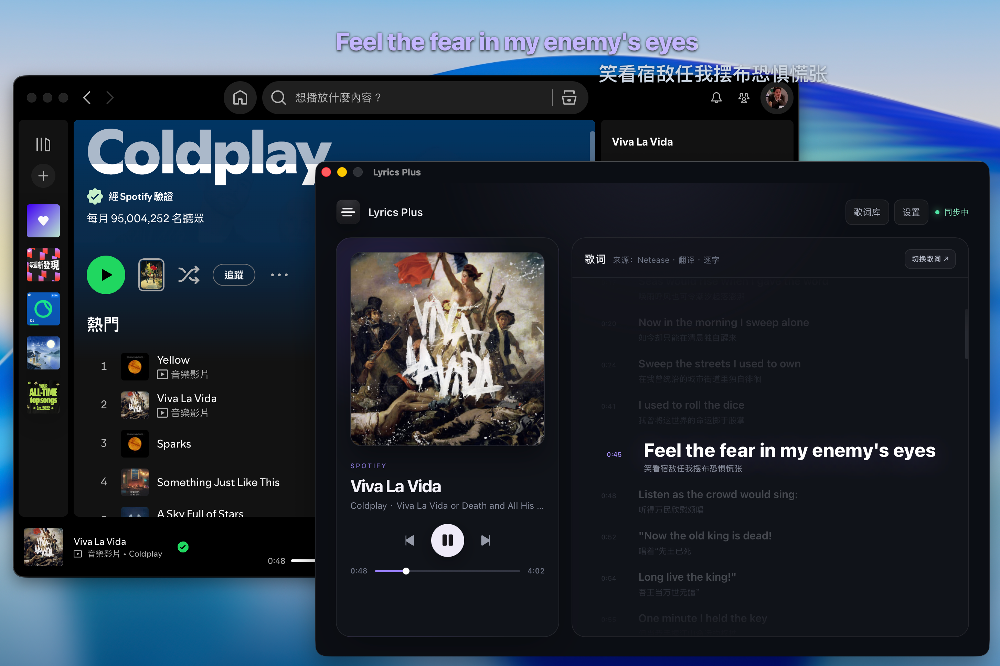

<div align="center">
  <h1>Lyrics Plus</h1>
  <p>面向 macOS 的桌面同步歌词应用，让歌词自然地融入桌面。</p>
  <p><strong>macOS 13+ · Apple Silicon & Intel · MIT License</strong></p>
  <p>简体中文 · <a href="README.md">English</a></p>
</div>

Lyrics Plus 会自动同步 Apple Music、Spotify，或通过系统媒体通道提供兼容信息的第三方 macOS 音乐应用的当前歌曲、播放状态和进度，并在主窗口与桌面浮窗中展示同步歌词。当前功能范围已经完整，支持多歌词源、翻译与音译、逐词时间轴、歌词库以及高度可定制的桌面歌词。

项目基于 Tauri 2、React、TypeScript 和 Rust 构建，专注于 macOS 原生桌面体验。

## 五种歌词模式


透明背景、横排单排、横排双排、竖排单排和竖排双排可以自由切换，并可继续调整字号、颜色、透明度、背景和对齐方式。

## 功能支持

| 分类 | 功能 | 状态 |
|---|---|:---:|
| 播放器 | Apple Music 播放信息同步 | ✅ |
| 播放器 | Spotify 播放信息同步 | ✅ |
| 播放器 | 兼容的第三方 macOS 音乐应用系统媒体同步 | ✅ |
| 播放器 | 系统媒体来源选择与第三方应用白名单 / 黑名单 | ✅ |
| 播放器 | 歌曲、播放状态与播放进度自动同步 | ✅ |
| 歌词获取 | 多歌词源并发搜索与候选结果推荐 | ✅ |
| 歌词获取 | 手动切换候选歌词与按歌名重新搜索 | ✅ |
| 歌词获取 | 本地 LRC 导入与歌曲关联 | ✅ |
| 歌词管理 | 歌词库、离线缓存与同步偏移调整 | ✅ |
| 歌词内容 | 同步歌词、翻译与音译 | ✅ |
| 歌词内容 | 逐词时间轴 | ✅ |
| 桌面歌词 | 透明、纯色与玻璃背景 | ✅ |
| 桌面歌词 | 横排、竖排、单排与双排布局 | ✅ |
| 桌面歌词 | 逐词扫光、弹跳与高亮效果 | ✅ |
| 桌面歌词 | 字号、颜色、透明度与长文本处理 | ✅ |
| 桌面浮窗 | 置顶、跨桌面空间与多显示器显示 | ✅ |
| 桌面浮窗 | 移动、缩放、锁定、鼠标穿透与位置复位 | ✅ |
| 系统能力 | 菜单栏入口、窗口状态恢复与全局快捷键 | ✅ |
| 高级设置 | JSONC 配置编辑、导入导出与实时调试日志 | ✅ |
| 国际化 | 简体中文、繁体中文与英文界面 | ✅ |

## 卡拉 OK 逐词效果

<table>
  <tr>
    <th width="50%">逐词扫光</th>
    <th width="50%">逐词弹跳</th>
  </tr>
  <tr>
    <td></td>
    <td></td>
  </tr>
</table>

具有逐词时间轴的歌词可以使用扫光、弹跳或整词高亮效果；普通同步歌词仍会按行准确切换。

## 播放器集成

<table>
  <tr>
    <th width="50%">Spotify</th>
    <th width="50%">Apple Music</th>
  </tr>
  <tr>
    <td></td>
    <td></td>
  </tr>
</table>

Lyrics Plus 会读取当前播放器的歌曲信息和播放进度，并保持主窗口与桌面歌词同步。歌词由独立的第三方歌词服务检索，不依赖播放器是否提供内置歌词。

除了 Apple Music 和 Spotify 的专用集成外，系统媒体模式还可以跟随通过 macOS 系统媒体通道提供 Now Playing 元数据的第三方音乐应用。在“设置 → 应用”中可使用白名单仅接管指定应用，或使用黑名单排除浏览器等应用；新安装默认使用空白名单，不接管任何第三方来源。具体能否读取元数据以及执行播放控制，取决于音乐应用实际提供的能力。

## 下载与首次运行

前往 [GitHub Releases](https://github.com/afeibukaixin/Lyrics-Plus/releases/latest) 下载适合当前 Mac 的最新版本：

- Apple Silicon：M1、M2、M3、M4 及后续 Apple 芯片机型。
- Intel：使用 Intel 处理器的 Mac。

将应用移动到“应用程序”文件夹后打开。

> [!IMPORTANT]
> 当前版本使用 macOS ad-hoc 签名，暂未配置 Apple Developer ID 签名和公证。如果 macOS 阻止首次打开，请前往“系统设置 → 隐私与安全性”，确认应用来源后选择“仍要打开”。

Apple Music 和 Spotify 的专用集成可能会触发 macOS 自动化权限请求。请在“系统设置 → 隐私与安全性 → 自动化”中允许 Lyrics Plus 控制这两个应用；该权限与第三方应用使用的系统媒体通道相互独立。

在线歌词依赖第三方服务，搜索结果和响应速度可能随网络环境与服务状态变化。

## 全局快捷键

| 快捷键 | 功能 |
|---|---|
| `⌘ ⇧ L` | 显示或隐藏桌面歌词 |
| `⌘ ⇧ U` | 锁定或解锁桌面歌词 |
| `⌘ ⇧ 0` | 复位并显示桌面歌词 |

## 本地开发

需要 Node.js、pnpm、Rust 工具链和 Xcode Command Line Tools。

```bash
git clone https://github.com/afeibukaixin/Lyrics-Plus.git
cd Lyrics-Plus
pnpm install
pnpm tauri dev
```

构建本地安装包：

```bash
pnpm tauri build
```

提交改动前，建议至少执行：

```bash
pnpm exec tsc --noEmit
cd src-tauri && cargo test
```

界面、国际化、排版和日志改动应遵循项目现有约定：[`i18n`](docs/i18n.md)、[`typography`](docs/typography.md) 和 [`logging`](docs/logging.md)。欢迎提交 Issue 和 Pull Request。

## 开发说明

> [!TIP]
> Lyrics Plus 也是一次由自然语言和 AI 工具驱动的 Vibe Coding 实验。作者负责产品设计、需求定义、测试与维护，代码实现由 AI 协作完成。初版功能完成时，AI 额度也刚好用光——算是一次很有仪式感的收尾。

## 免费、联网与版权说明

Lyrics Plus 是出于个人兴趣开发和维护的开源项目。官方渠道提供的软件本体完全免费，不设会员、订阅、激活码或强制付费。第三方在遵守 MIT License 的前提下可以分发或销售软件副本，但相关下载、安装或打包服务与本项目无关，也不是使用本软件所必需的。

启用在线歌词源时，歌曲标题、歌手、专辑和时长等用于匹配歌词的信息会发送给相应的第三方服务。其内容、可用性、准确性、授权范围和数据处理规则由服务提供方决定。

歌词、专辑封面及其他音乐相关内容的权利归相应权利人所有。Lyrics Plus 仅提供检索、解析、缓存、导入和展示功能，不拥有或授予这些内容的版权。本项目与 Apple Music、Spotify、歌词服务、内容平台及权利人不存在隶属、代理或背书关系。

请在法律法规和相关服务条款允许的范围内使用本软件。本软件按“现状”提供，不保证第三方服务持续可用或匹配结果完全准确；请自行备份重要的本地歌词和配置。

## 致谢

Lyrics Plus 的产品方向、交互思路和歌词应用经验参考了以下开源项目：

- [MxIris-LyricsX-Project/LyricsX](https://github.com/MxIris-LyricsX-Project/LyricsX)
- [ddddxxx/LyricsX](https://github.com/ddddxxx/LyricsX)

感谢原作者和维护者们对 macOS 歌词应用生态的长期投入。

## License

本项目以 [MIT License](LICENSE) 发布。
