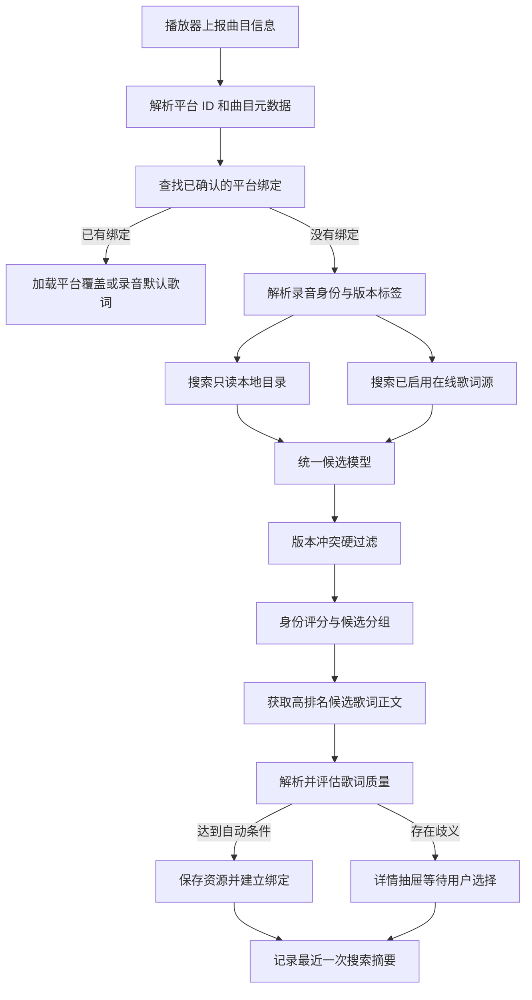

# Lyrics Plus 歌词管理与搜索 V2 完整改造计划

本轮歌曲平台管理约束以 [领域文档](./lyrics-management-v2-domain.md#歌曲平台关联管理) 为准：每个平台最多一条曲目、歌曲共用歌词、各平台独立偏移。下列搜索源和迁移阶段保留为历史实施记录；歌曲关联只通过用户确认，不由歌词搜索自动修改。

## 一、目标与已确定的原则

把当前以 `track_key -> 单个歌词文件` 为核心的结构，改造成以“具体录音版本 Recording”为核心的歌词管理系统：

- 同一个录音版本可以关联 Spotify、Apple Music、QQ 音乐、网易云等多个平台曲目 ID。
- 同一个歌曲版本只使用一副共用默认歌词；其他资源保留为非默认绑定，各平台独立偏移。旧平台资源覆盖只兼容读取，管理操作时规范化。
- Live、Remix、Acoustic、Remaster、Clean、Explicit、伴奏、加速版等必须区分，不能因为标题和歌手相似而自动合并。
- 应用下载歌词、本地用户歌词、临时缓存彻底分开。
- 歌词源通过统一清单管理，不再把名称、能力、默认开关散落在具体实现中。
- 保留现有绑定；旧别名只作为低可信线索，不再直接触发合并。
- 不自动搬动任何历史歌词文件。
- 本轮不做作品/作曲层、不做歌词正文编辑器、不接入 MusicBrainz 联网查询、不开放自定义 HTTP 歌词源。

汽水音乐结论：从 [Lyricify-Lyrics-Helper](https://github.com/WXRIW/Lyricify-Lyrics-Helper) 和 [Lyrics-Helper](https://github.com/afeibukaixin/Lyrics-Helper) 的实现推断，它能提供质量不错的 KRC、逐字时间和部分翻译，但使用的是非公开接口，搜索结果容易混入 Live、翻唱、钢琴版等版本，稳定性也不可承诺。因此保持默认关闭并标记为实验源；用户主动开启后，仍参与统一自动匹配。

## 二、目标搜索流程

界面对应状态固定为：

`识别歌曲 → 查找已有绑定 → 搜索本地目录 → 搜索在线来源 → 比较录音版本 → 自动应用/等待选择`

## 三、分阶段实施清单

### 阶段 1：冻结 V2 术语和行为边界

- [x] 建立一份歌词领域设计文档，统一使用以下术语（见 [lyrics-management-v2-domain.md](./lyrics-management-v2-domain.md)）：
  - `Recording`：具体录音版本，是本轮核心实体。
  - `TrackObservation`：播放器从某个平台观察到的一条曲目信息。
  - `ExternalIdentifier`：带命名空间和类型的平台 ID。
  - `LyricAsset`：一份真实歌词内容或文件。
  - `LyricsBinding`：录音版本与歌词资源之间的关联。
  - `PlatformOverride`：各平台时间偏移，并兼容读取未操作历史歌曲的歌词覆盖。
- [x] 明确“同一首作品”不等于“同一录音版本”；本轮不创建 Work/Composition 表（见 [lyrics-management-v2-domain.md](./lyrics-management-v2-domain.md)）。
- [x] 列出版本标签规范：`original`、`live`、`acoustic`、`remix`、`remaster`、`clean`、`explicit`、`instrumental`、`karaoke`、`radio_edit`、`sped_up`、`slowed`、`demo`（见 [lyrics-management-v2-domain.md](./lyrics-management-v2-domain.md)）。
- [x] 确定所有合并和拆分都不得删除歌词文件；修正绑定必须可逆（见 [lyrics-management-v2-domain.md](./lyrics-management-v2-domain.md)）。
- [x] 将目标流程图和状态定义写入项目文档，后端事件和前端文案都以它为准（见 [lyrics-management-v2-domain.md](./lyrics-management-v2-domain.md)）。

完成标准：数据库、后端、前端对“曲目、录音、平台观察、歌词资源”不再混用同一个概念。

### 阶段 2：建立可迁移的数据库版本机制

- [x] 使用 SQLite `PRAGMA user_version` 管理数据库版本，不再只依赖 `CREATE TABLE IF NOT EXISTS`（见 `src-tauri/src/storage/database.rs` 的 `migrate_schema`）。
- [x] 每次迁移放在单个事务中；失败时完整回滚（数据库迁移、旧索引迁移和别名迁移均使用事务，旧文件清理由提交后的步骤执行）。
- [x] 迁移前使用 SQLite 一致性备份机制生成带时间戳的数据库备份（使用 `rusqlite` Online Backup API，保存到应用数据目录的 `database-backups`）。
- [x] 本轮只增加新表和索引，不删除旧表（版本迁移仅执行建表、建索引和兼容列追加；运行时解绑清理不属于迁移）。
- [x] 在过渡期保留旧表读取兜底，并对当前生效绑定进行新旧结构双写。
  - `load_with_status` 优先读取 V2 绑定，资源缺失或不可用时回退旧表；保存和本地关联继续写旧结构，同时同步写入 V2 资源、来源证据和 Recording 绑定。
- [x] 记录迁移版本、开始时间、结束时间和失败原因，但不记录歌词正文、令牌或接口原始响应。
  - 已增加 `storage_migration_logs`，每个版本迁移在事务执行前记录开始状态，提交后记录完成时间；失败时记录 SQLite 错误原因，不写入歌词、令牌或原始响应。

完成标准：旧版本数据库可以无损升级；迁移失败后仍可继续使用旧结构。

### 阶段 3：建立 Recording 身份模型

- [x] 新建 `recordings`（数据库迁移版本 3）：
  - 规范标题、专辑、时长和版本标签。
  - 不直接保存某个平台特有 ID。
- [x] 新建 `track_observations`（数据库迁移版本 4）：
  - 保存原始 `track_key`、平台、原始标题、歌手列表、专辑、时长和抓取时间。
  - 每个播放器曲目只能指向一个 Recording。
- [x] 新建 `recording_external_ids`（数据库迁移版本 5）：
  - 字段至少包含 `namespace`、`id_kind`、`value`、`recording_id`、`confidence`、`confirmed`。
  - 区分 Spotify track ID、Apple catalog ID、Apple persistent ID、QQ songmid、网易云 ID、ISRC 等，禁止仅保存一个无类型字符串。
- [x] 新建歌手与署名结构（数据库迁移版本 6）：
  - 保存原始歌手名称和顺序。
  - 区分主唱、参与歌手、未知角色。
  - 保存已确认别名；中英文名只有用户确认后才视为同一歌手。
- [x] Spotify 只返回主唱时允许成为完整署名的子集，但必须降低匹配置信度。
  - 已将播放器平台上下文带入歌词评分；Spotify 署名集合不完整时保留候选，但整体匹配分数降低，主唱冲突的硬拒绝仍由后续统一身份匹配阶段处理。
- [x] 提供“确认属于同一录音”和“拆分为独立录音”操作；只调整关联，不物理合并或删除数据。
  - 已提供事务化存储操作和 Tauri 命令：确认操作移动 `track_observations` 并确认精确平台 ID；拆分操作复制录音元数据/署名后移动当前观察，不删除旧实体、歌词关联或文件。

身份匹配优先级固定为：

1. 用户确认过的平台映射。
2. 完全一致的平台曲目 ID。
3. 完全一致的 ISRC 或已知录音 ID。
4. 标题、歌手集合、专辑、时长和版本标签综合匹配。
5. 旧数据库别名只能辅助展示，不能单独触发自动合并。

### 阶段 4：重建歌词资源与绑定模型

- [x] 新建 `lyric_assets`，每份歌词保存：
  - 来源类别：`managed`、`local`、`legacy`、`cache`。
  - 来源 provider、provider item ID、格式、语言。
  - 时间能力：纯文本、逐行、逐字。
  - 是否含翻译、音译。
  - 内容指纹、根目录 ID、相对路径和可用状态。
- [x] 相同内容指纹只保存一份资源记录；不同来源仍保留来源证据。
  - 资源按内容指纹唯一复用，`lyric_asset_sources` 单独记录各来源和路径证据。
- [x] 新建 `recording_lyric_bindings`：
  - 一个 Recording 可以有多个候选资源。
  - 一个 Recording 只能有一个默认生效资源。
  - 保存选择来源：用户、自动、迁移。
  - 保存置信度、匹配证据和默认偏移量。
- [x] 新建 `platform_lyric_overrides`：
  - 同一 Recording 在某个平台音频剪辑或起始时间不同时，可以使用不同歌词或偏移。
  - 没有覆盖时继承 Recording 默认歌词。
- [x] 解绑只取消生效关系，不删除 `lyric_assets` 或磁盘文件。
  - 解绑仅取消默认绑定并清理平台覆盖；资源记录和文件不通过解绑入口删除，旧文件清理也会保护仍被 V2 来源引用的路径。
- [x] 删除下载歌词必须作为未来独立能力处理，本轮不提供删除入口。

### 阶段 5：迁移现有数据库数据

- [x] 每个现有 `track_key` 创建一条 `track_observation` 和对应 Recording。
  - 启动迁移会合并读取旧关联、历史和别名中的曲目标识，为每个有效标题/歌手创建观察与 Recording。
- [x] 现有 `lyric_associations` 转成默认 `recording_lyric_binding`：
  - `manual_selected=true` 标记为迁移后的用户确认绑定。
  - 自动产生的关联标记为迁移自动绑定，但继续保持生效。
- [x] 保留原来的 `provider_id` 和 `provider_item_id`，转换成带类型的来源标识。
  - V2 来源证据保留两个旧字段；平台曲目标识按 QQ songmid、网易云 song_id、酷狗 file_hash、Spotify track_id 等类型写入外部 ID 表。
- [x] 现有 `lyric_track_aliases` 全部迁移为 `unverified_legacy` 证据，不继续自动合并新曲目。
  - 别名增加 evidence_kind，新观察只保留精确旧键映射，不再按标题/歌手自动合并多个旧关联。
- [x] 根据 `lyric_files.app_owned` 重新标记资源所有权：
  - 迁移按文件索引的 app_owned 选择 legacy 或 local 资源类别。
  - `true` 转为历史应用资源。
  - `false` 转为历史本地资源。
- [x] 不移动任何现有文件；原目录仅登记为内部迁移兼容根，不在设置页展示。
- [x] 迁移完成后核对新旧结构中的生效绑定数量，数量不一致时保持旧读取路径并报告差异。
  - 启动迁移记录旧/新生效绑定数量差异；V2 读取失败继续回退旧关联。

### 阶段 6：彻底拆分三类歌词存储

- [x] 新建 `library_roots`，类型固定为：
  - `managed`：应用可写的下载目录。
  - `local`：用户绑定的只读目录。
  - `legacy`：旧混合目录，只读。
  - `cache`：Application Support 下的内部缓存。
- [x] 新安装默认托管目录设为 `~/Music/Lyrics Plus`。
- [x] 旧安装的 `Downloaded` 文件、目录和旧关联保持原位；托管根切换到父目录后继续通过父目录扫描读取，不搬文件。
- [x] 用户可以绑定多个本地目录，并为每个目录执行启用、停用、刷新和解除绑定。
- [x] 本地目录不得与托管目录、缓存目录或其他根目录互相嵌套；保存前解析真实路径并检查重叠。
- [x] 本地目录扫描只使用当前已经支持的歌词格式，不顺带扩展新格式。
- [x] 启动后根据路径、大小、修改时间和内容指纹进行增量扫描；设置页提供手动刷新。
- [x] 文件删除后标记为不可用，不立即删除索引和历史绑定。
- [x] 同一根目录内文件改名时使用内容指纹恢复关联。
- [x] 应用不得移动、覆盖或删除 `local`、`legacy` 类型下的文件。
- [x] 新下载文件先写临时文件，再原子替换目标，防止中途退出留下半个文件。

### 阶段 7：将歌词源改造成统一清单

- [x] 保留每个来源的 Rust 实现，但增加唯一的内置 Provider Manifest。
  - Provider 注册表现在只从集中 Manifest 暴露来源描述；休眠实现文件仍保留。
- [x] Manifest 至少声明：
  - `id`、显示名称、实现键。
  - 分级和是否在界面显示。
  - 默认是否启用、是否允许自动绑定。
  - 支持按元数据搜索还是按 ID 查询。
  - 支持纯文本、逐行、逐字、翻译、音译中的哪些能力。
  - 是否需要凭据。
  - 内容持久化策略：下载库、仅缓存或仅内存。
- [x] 数据库只保存用户策略，例如启用状态、优先级和权重；不复制整份内置清单。
  - Manifest 为代码内置清单，持久化配置仍只保存 Provider 策略和凭据。
- [x] Manifest 与实现注册表启动时互相校验，避免出现“界面有入口但没有实现”。
  - 注册时检查非休眠 Manifest 是否都有实现，未知实现会记录错误。
- [x] Dormant 来源即使旧设置中为启用，也不得实例化、发起请求或显示入口。
  - Kuwo/Migu 仍保留实现代码，但不会加入实例注册表；设置清单后续读取 Manifest。
- [x] 不开放用户自定义 HTTP 地址、解析脚本或外部插件协议。

Provider 分级仅作为后端策略使用，设置页不展示分级或能力标签。默认状态为：

| 来源 | 默认状态 | 自动绑定内部策略 |
|---|---:|---:|
| QQ 音乐 | 开启 | 允许 |
| 网易云音乐 | 开启 | 允许 |
| 酷狗音乐 | 开启 | 允许 |
| LRCLIB | 开启 | 允许 |
| AMLL TTML | 开启 | 允许 |
| Musixmatch | 关闭 | 用户启用后允许 |
| 汽水音乐 | 关闭 | 开启后允许自动应用 |
| 酷我音乐 | 不展示 | 禁止 |
| 咪咕音乐 | 不展示 | 禁止 |

LRCLIB 的时长匹配继续遵循其接口特性；AMLL 仅在拥有可信平台 ID 时优先查询。[LRCLIB 文档](https://lrclib.net/docs)、[AMLL TTML Database](https://github.com/amll-dev/amll-ttml-db)。

### 阶段 8：拆分“搜索候选”和“下载歌词”

- [x] 将 Provider 接口拆为：
  - `search`：只返回候选元数据和来源 ID。
  - `lookup_by_id`：按精确平台 ID 获取候选。
  - `fetch`：用户选中或候选进入高排名后才获取歌词正文。
- [x] 统一 `ProviderCandidate`，至少包含标题、歌手数组、专辑、时长、版本标签、平台 ID、歌词能力和来源。
- [x] 搜索阶段每个在线来源最多保留用户设置的候选数，默认 20 条（范围 1–100）；精确平台 ID 查询不受普通候选上限影响。
- [x] 精确 ID 候选优先获取正文；其他来源按排序模式逐批获取，单个候选失败时继续补位。自动搜索将 5 条作为首批展示目标，并在仍可能反超时继续比较，正文检查最多 24 条；交互搜索最多获取 24 条候选正文。
- [x] 在线搜索最多并发 4 个来源；单次搜索和正文获取默认各 8 秒超时，允许 Manifest 针对来源覆盖。
- [x] 单个来源超时或失败不能中断其他来源和本地搜索。
- [x] 搜索结果按 `provider_id + provider_item_id` 去重；正文获取后再按内容指纹去重。
- [x] Provider 只负责转换来源数据，版本判断、评分、保存和绑定全部由统一搜索服务完成。

### 阶段 9：实现统一身份评分与自动绑定规则

候选身份分数按用户配置的五项权重归一化：

- 标题：40 分。
- 歌手：40 分，其中主歌手 24 分、参与歌手集合 16 分。
- 时长：默认权重 10；满分与部分得分容差由用户配置，默认分别为 2 秒和 5 秒。
- 版本标签：5 分。
- 专辑：5 分。

- [x] 标题做大小写、空白、标点和常见 `feat.` 分隔规范化；繁简统一沿用用户配置。
- [x] 已由用户确认的歌手别名可以等价匹配；未经确认的名称只能降低或提高少量排序信息，不能决定自动绑定。
- [x] Spotify 等来源缺少参与歌手时按“署名子集”处理，降低分数但不直接拒绝。
- [x] 出现额外且冲突的主歌手时，除非平台 ID 或 ISRC 完全一致，否则禁止自动绑定。
- [x] Live、Remix、Acoustic、Instrumental、Karaoke、Clean/Explicit 等已识别标签冲突时直接排除自动绑定。
- [x] 标签缺失不算冲突，但不得获得版本分。
- [x] 元数据自动绑定条件为：
  - 总分达到用户的自动应用阈值，新安装默认 85。
  - 无版本硬冲突。
  - 歌词可以成功解析且不是空内容。
- [x] 精确平台 ID、ISRC 或用户确认映射可以绕过普通分数门槛，但仍需通过歌词解析。
- [x] 内容质量只用于同一身份候选之间排序，不能弥补身份分不足：
  - 逐字优先于逐行，逐行优先于纯文本。
  - 用户需要翻译或音译时，对相应能力加优先级。
  - 时间轴大量倒序、空行或无法解析的候选降级或淘汰。
- [x] 所有已开启且可见的歌词源都遵循统一自动绑定规则；实验源仍默认关闭，开启后不再单独禁止自动绑定。

### 阶段 10：保存最近一次搜索过程

- [x] 新建 `lyrics_search_runs` 和 `lyrics_search_candidates`。
- [x] 每个 Recording 只保留最近一次搜索摘要，新搜索完成后事务性替换旧记录。
- [x] 搜索摘要记录：
  - 各阶段开始、结束和状态。
  - 每个来源是否跳过、成功、超时或失败。
  - 候选数量和耗时。
  - 候选得分、版本标签、淘汰原因和最终选择理由。
- [x] 不保存接口原始响应、Cookie、Token、完整歌词正文或本地绝对路径。
- [x] 本地路径在界面中显示为“根目录名称 + 相对路径”。
- [x] 搜索过程中通过统一事件发送实时状态；重新打开抽屉时读取数据库里的最近摘要。

### 阶段 11：增加后端公开类型和 Tauri 接口

- [x] 增加统一公开类型：
  - `RecordingIdentity`
  - `TrackObservation`
  - `ExternalIdentifier`
  - `ArtistCredit`
  - `LyricAsset`
  - `LyricsBinding`
  - `ProviderDescriptor`
  - `ProviderCandidate`
  - `LyricsSearchTrace`
- [x] 增加 V2 命令：
  - `get_current_lyrics_context`
  - `search_lyrics_v2`
  - `select_lyrics_candidate`
  - `get_song_association_candidates`
  - `associate_song_candidate`
  - `detach_platform_track`
  - `clear_lyrics_binding`
  - `import_local_lyrics`
  - `list_library_roots`
  - `add_library_root`
  - `remove_library_root`
  - `rescan_library_root`
  - `get_provider_catalog`
  - `update_provider_policy`
- [x] 增加 `lyrics-search-progress` 事件，携带 `run_id`、阶段、来源、状态、耗时和候选数量。
- [x] 旧歌曲 merge/split/restore 命令及平台专属歌词写入入口已移除；读取兼容保留。
- [x] 所有选择、解绑、覆盖和身份修正操作都由后端事务完成，前端不得直接拼接数据库状态。

### 阶段 12：实现“当前歌曲详情抽屉”

- [x] 抽屉顶部展示当前 Recording：
  - 规范标题、专辑、时长和版本标签。
  - 当前平台曲目 ID。
  - 原始歌手署名与规范署名。
- [x] “已关联平台”区域按平台逐行展示：
  - 平台曲目原始标题、歌手、专辑和时长。
  - 平台 ID 类型、ID 值及已确认状态。
  - 当前播放平台标识。
  - 多平台歌曲可执行“移出当前歌曲”。
- [x] “歌曲共用歌词”区域展示：
  - 来源、格式、语言、逐行/逐字能力。
  - 托管、本地、历史或缓存标识。
  - 自动、手选或迁移绑定来源。
  - 当前平台偏移和平台覆盖状态。
- [x] 提供重新搜索、切换版本、解除绑定、导入本地文件、设置偏移操作。
- [x] 搜索过程使用阶段条展示，并在在线搜索阶段展开各 Provider 状态。
- [x] “可能属于同一歌曲”候选按 Recording 实体分组，并展示候选实体的全部平台观察和外部 ID；原关联歌曲置顶标记。
- [x] 每个关联候选展示固定门槛与用户权重排序的证据，而不是只显示总分：
  - 标题匹配。
  - 歌手匹配、已确认别名和署名完整性。
  - 时长差。
  - 专辑匹配。
  - 版本一致或冲突。
  - ISRC 等跨平台录音标识和歌词相似度辅助证据。
- [x] 关联候选时只确认平台关系；当前歌曲已有共用歌词时继续保留，当前没有而候选有默认歌词时采用候选默认歌词。
- [x] 候选操作统一为“关联到当前歌曲”；不再提供独立的“合并回原歌曲”按钮。
- [x] 身份可能误合并时按平台提供“移出当前歌曲”，可选择“暂不绑定歌词”或“沿用歌曲共用歌词”；原歌曲作为普通候选重新出现。
- [x] 歌词搜索结果只提供“设为歌曲歌词”，不再提供“仅用于当前平台”。
- [x] 本轮不提供歌词正文修改和逐字打轴入口。

### 阶段 13：重做歌词来源与目录设置页

- [x] 来源设置完全读取 Provider Manifest，不再维护前端硬编码来源列表。
- [x] 所有可用来源按用户优先级显示为单一扁平列表，不展示内部分级。
- [x] 汽水音乐始终显示并使用自身开关；已有启用状态保留，新安装默认关闭。
- [x] 休眠来源不显示，不允许通过旧配置重新启用。
- [x] 每个来源只显示名称、顺序、运行状态、配置入口、启用开关和测试操作。
- [x] 目录设置分成两个明确区域：
  - 应用下载目录：可写，未来下载位置。
  - 我的本地歌词：多个只读目录。
- [x] 每个本地目录显示文件数、最近扫描时间、不可用文件数和最近错误。
- [x] 修改应用下载目录只影响未来下载；旧目录作为内部迁移兼容数据保留，不搬文件且不在设置页展示。
- [x] 移除本地目录只移除索引入口，不删除磁盘文件；已有绑定标记不可用并保留恢复信息。

### 阶段 14：接入汽水音乐实验 Provider

- [x] 在统一 Provider 接口稳定后再实现汽水，不能提前直接塞入现有搜索函数。
- [x] 搜索和歌词获取请求参数、请求头及版本信息集中在适配器内部，避免散落常量。
- [x] 将汽水返回的曲目 ID 保存为带 `qishui` 命名空间的外部 ID。
- [x] 完整保留搜索结果中的歌手数组、专辑、时长和版本文字，不只取第一位歌手。
- [x] KRC 交给现有统一解析层处理，不在 Provider 内重新实现一套歌词模型。
- [x] 接口变化、限流、空结果和解析失败必须只影响汽水，不阻断整次搜索。
- [x] 不记录请求中的设备标识、Cookie 或完整响应。
- [x] 汽水默认关闭、标记“实验/非公开接口/可能失效”；用户开启后允许自动应用。
- [x] 汽水连续失败时本次搜索中熔断，不自动重试轰炸接口。
- [x] 后续是否晋升稳定层只依据真实使用数据另行讨论，本轮不自动晋升。

### 阶段 15：切换、观察与旧代码保留

- [x] 先让 V2 在新数据库有数据时优先读取，没有数据时回退旧关联。
- [x] 在过渡期对默认绑定进行新旧双写，保证短期降级版本仍能看到歌词。
- [x] 核对现有绑定全部迁移后，再让前端只调用 V2 接口。
- [x] 旧数据库表、旧 Provider 实现和休眠来源代码暂时保留，不在本轮清理。
- [x] 对旧搜索入口添加内部弃用标记，避免新代码继续引用。
- [x] 后续是否删除旧表、停止双写，作为单独计划处理。

## 四、验收场景与完成定义

本计划不安排构建步骤，也不要求新增测试文件；每个阶段通过数据库查询、日志检查和实际界面操作验收。

- [x] 同一录音在两个平台播放时能归到同一个 Recording，并共用默认歌词。
- [x] 某个平台音频时间不同，可以单独设置歌词或偏移，不影响其他平台。
- [x] Spotify 只有主唱、另一平台包含合唱者时，可以成为候选，但不会在证据不足时直接自动合并。
- [x] 中英文歌手名未经用户确认不会自动当作同一人；确认后后续可以匹配。
- [x] 原版、Live、Remix、伴奏和 Clean/Explicit 不会因标题相似自动错绑。
- [x] 一首歌能看到多个歌词资源，并明确知道当前选择的是哪一个及选择原因。
- [x] 用户本地目录中的文件不会被应用移动、覆盖或删除。
- [x] 应用新下载歌词只进入新的托管目录，不再写入用户绑定目录。
- [x] 历史文件路径保持不变，原有数据库绑定数量迁移前后能够对应。
- [x] 单个歌词源超时不会卡住整个搜索，抽屉能显示失败来源和剩余进度。
- [x] 汽水只在用户启用实验来源后出现，并遵循统一自动绑定规则。
- [x] 酷我和咪咕没有设置入口、不会实例化、不会发起网络请求，但实现代码仍保留。
- [x] 关闭并重新打开应用后，仍能查看当前歌曲最近一次搜索摘要和候选理由。
- [x] 解除绑定、拆分错误 Recording 或移除目录后，不会删除任何歌词文件。
- [x] 搜索记录和日志中不存在 Token、Cookie、完整接口响应及本地绝对路径。

## 五、明确不在本轮实施的内容

- 作品/作曲层以及原唱、翻唱之间的作品关系。
- 歌词正文编辑器、逐行或逐字打轴工具。
- MusicBrainz 主动联网查询；只预留外部 ID 类型。
- Apple Music、Spotify 等新的歌词适配器。
- 用户自定义 HTTP 来源或可安装歌词源插件。
- 本地目录实时文件监听。
- 自动移动、整理或删除历史歌词文件。
- 长期保存全部搜索历史。
- 删除旧数据库表和休眠 Provider 代码。
